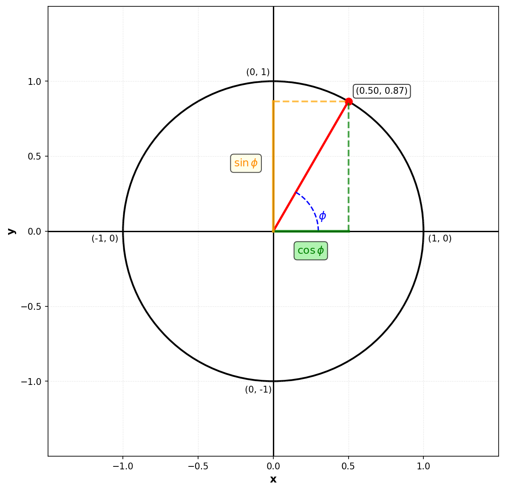
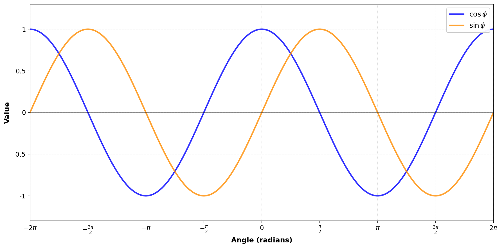

# Defining Sine and Cosine

The sine and cosine functions are fundamental to describing angles and periodic behaviour. They are defined using the unit circle: a circle of radius 1 centered at the origin of a coordinate system.

## The Unit Circle Definition

Given an angle $\phi$ measured in **radians** from the positive $x$-axis, the sine and cosine of $\phi$ are defined as:

$$
\cos \phi = \text{the } x\text{-coordinate of the point on the unit circle at angle } \phi \\
\sin \phi = \text{the } y\text{-coordinate of the point on the unit circle at angle } \phi
$$

Visually:

The blue line represents the angle $\phi$ measured counterclockwise from the positive $x$-axis. The point on the circle is at coordinates $(\cos \phi, \sin \phi)$. The green line shows $\cos \phi$ (the horizontal distance from the origin), and the orange line shows $\sin \phi$ (the vertical distance from the origin).

# Key Properties

**Range:** Since the point lies on a circle of radius 1, both sine and cosine are always between $-1$ and $1$:

$$
-1 \leq \sin(x) \phi \leq 1 \\
-1 \leq \cos(x) \phi \leq 1
$$

**Periodicity:** As we continue rotating around the circle, the functions repeat every $2\pi$ radians (one complete revolution):

$$
\sin(\phi + 2\pi) = \sin \phi \\
\cos(\phi + 2\pi) = \cos \phi
$$

# Evaluating Sine and Cosine at Key Angles

Here are the values at frequently-used angles (in radians):

| Angle (deg) | $0°$ | $30°$ | $45°$ | $60°$ | $90°$ | $180°$ | $270°$ | $360°$ |
| Angle (rad) | $0$ | $\pi/6$ | $\pi/4$ | $\pi/3$ | $\pi/2$ | $\pi$ | $3\pi/2$ | $2\pi$ |
|-------|-----|---------|---------|---------|---------|-------|----------|---------|
| $\cos \phi$ | $1$ | $\frac{\sqrt{3}}{2}$ | $\frac{\sqrt{2}}{2}$ | $\frac{1}{2}$ | $0$ | $-1$ | $0$ | $1$ |
| $\sin \phi$ | $0$ | $\frac{1}{2}$ | $\frac{\sqrt{2}}{2}$ | $\frac{\sqrt{3}}{2}$ | $1$ | $0$ | $-1$ | $0$ |

Notice how cosine starts at its maximum value of $1$ when $\phi = 0$, while sine starts at $0$. As $\phi$ increases, cosine decreases while sine increases, until they swap roles at $\phi = \pi/2$.

# Visualizing the Functions

The graphs of sine and cosine show how their values change as the angle increases:

Both functions oscillate smoothly between $-1$ and $1$, with a period of $2\pi$. Notice that the cosine graph is simply the sine graph shifted to the left by $\pi/2$ radians. This relationship is expressed as:

$$
\cos \phi = \sin\left(\phi + \frac{\pi}{2}\right)
$$

# Why Radians?

Angles are usually measured in **radians** in mathematics (as opposed to degrees). One complete revolution around the circle is $2\pi$ radians, equivalent to $360°$. Radians are dimensionless and make the mathematics much cleaner—for instance, the derivatives and many trigonometric identities take their simplest forms when angles are in radians.

To convert between radians and degrees: $\text{radians} = \frac{\pi}{180} \times \text{degrees}$.

### Summary

Sine and cosine are the $y$ and $x$ coordinates, respectively, of a point on the unit circle at a given angle. They oscillate periodically between $-1$ and $1$ with a period of $2\pi$ radians, and their values at common angles are essential to working with rotations, periodic phenomena, and the polar representation of complex numbers.
